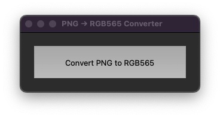

# PNG to RGB565 Converter

A simple GUI tool to convert PNG images to C header files with RGB565 format data.

## Requirements

- Python 3.13.0
- PIL (Pillow) library

If you do not have python installed

### Install Python

**Windows:**
1. Right-click `install_windows.bat`
2. Select "Run as administrator"

**macOS:**
1. Open Terminal
2. Type: `cd` (space) - drag the converter folder into terminal.
3. Paste: `chmod +x install_macos.sh && ./install_macos.sh`

## Use Converter

1. Run the converter:
Windows:
   - Double-click `run_converter.bat`
MacOS/Linux :
   - Double-click `run_converter.command`

2. Click "Convert PNG to RGB565" button

3. Select your PNG file

4. Choose where to save the .h file

The output will be a C header file containing a `uint16_t` array with RGB565 pixel data.
If no destination folder is selected the file will be output relative to the original file.

## Output Format

The generated .h file contains:
- Image dimensions as comments
- `const uint16_t image[]` array with RGB565 values
- Transparent pixels converted to 0x0000

## Compatibility

- Windows ✓
- macOS ✓
- Linux ✓